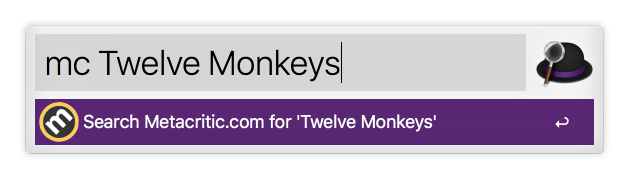

# Alfred Workflow for Metacritic
This workflow lets you search [Metacritic](http://www.metacritic.com) with the query you input. 




## Download and install
Latest version: [v0.1.0](https://github.com/simeg/alfred-workflow-metacritic/archive/master.zip)

0. Download the repository
0. Open `metacritic.alfredworkflow` by double-clicking it or dragging it into Alfred

## Usage
```
mc <search term>
```
The `<search term>` corresponds to what you would enter if you were searching on the Metacritic website. After inputting a search term and pressing enter, a new tab in your default browser will open the result page on Metacritic's website.

## License
(MIT) The license can be found in the [LICENSE](LICENSE.md) file.
